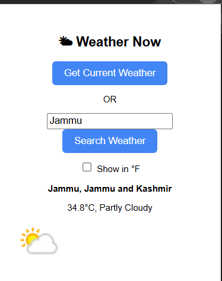

# 🌤 Weather Now - Chrome Extension

This is a simple Chrome Extension that fetches and displays the current weather based on your location using the WeatherAPI.

## 🔧 Features

- 📍 Uses geolocation to get your current coordinates.
- 🌡 Displays temperature in Celsius or Fahrenheit.
- 🌤 Shows weather conditions and an icon.
- 🔁 Saves last fetched weather for toggling units without reloading.

## 🚀 How to Use

1. Clone or download this repository.
2. Open Chrome and go to `chrome://extensions`.
3. Enable **Developer Mode** (top right).
4. Click **Load unpacked** and select this project folder.
5. Click the extension icon and get your local weather instantly!

## 📦 Files

- `popup.html` - Main UI of the extension
- `popup.js` - JavaScript for fetching weather and handling events
- `styles.css` - Optional styling (if used)

## 🌐 API Used

- [WeatherAPI](https://www.weatherapi.com/) - for real-time weather data.

## 🖼 Preview

Here’s how it looks in action:

## 🛠 Future Improvements

- 🔍 Add search box to allow user to enter any city manually.
- 🌎 Support multi-language output.
- 💡 Add dark/light mode toggle.

---

📌 Built with ❤️ during Summer School Online Day 5.
